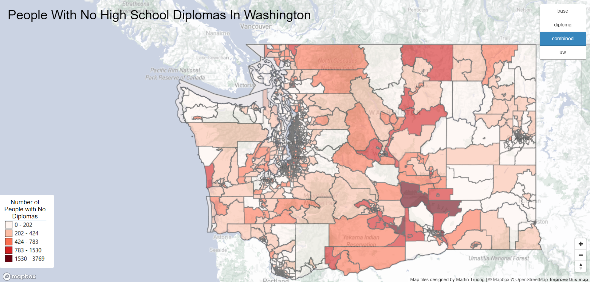
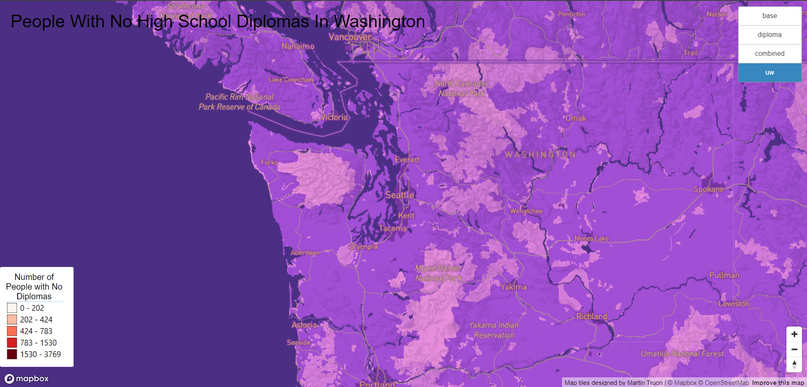

# Tile Generation

## Visualizing Different Maps With Tiles

My [webmap](https://matruong2.github.io/tile-generation/index.html) has 4 different layers showing each of the tile sets that I have created. I decided to focus the area around the Greater Seattle Area because the geospatial dataset I decided to work with was about the people without a High School Diploma in Washington State. All of the tile sets have an available zoom level from 3 to 12.

### Tile Set 1: Base Map

My first tile set is a base map where I adjusted the monochrome style on mapbox to have a little bit more color.

### Tile Set 2: No High School Diploma

My second tile set is a thematic layer that uses the high school graduation rate data from the [Washington Geospatial Open Data Portal](https://geo.wa.gov/datasets/d4a6f3c1a45d48b9b31de9ebaf5af4ee_0/explore?location=47.237631%2C-120.811974%2C8.00). I decided to use the number of people without a high school diploma to be represented on the map.

### Tile Set 3: Base Map + No Diploma

My third tile set combines tile set 1 and 2 to show what the map would like with my thematic layer on top of the customized base map.

### Tile Set 4: UW Themed Map

My fourth tile set is a map theme with uw related colors. I chose to make a uw related map because part of the importance of getting a high school diploma is that there would be more opportunities out in the world and one of them is being able to go to college. Obviously, there are cases where people can still go to college without a high school diploma, but it is a more difficult journey without one, so getting a diploma is something that young people should focus on.

